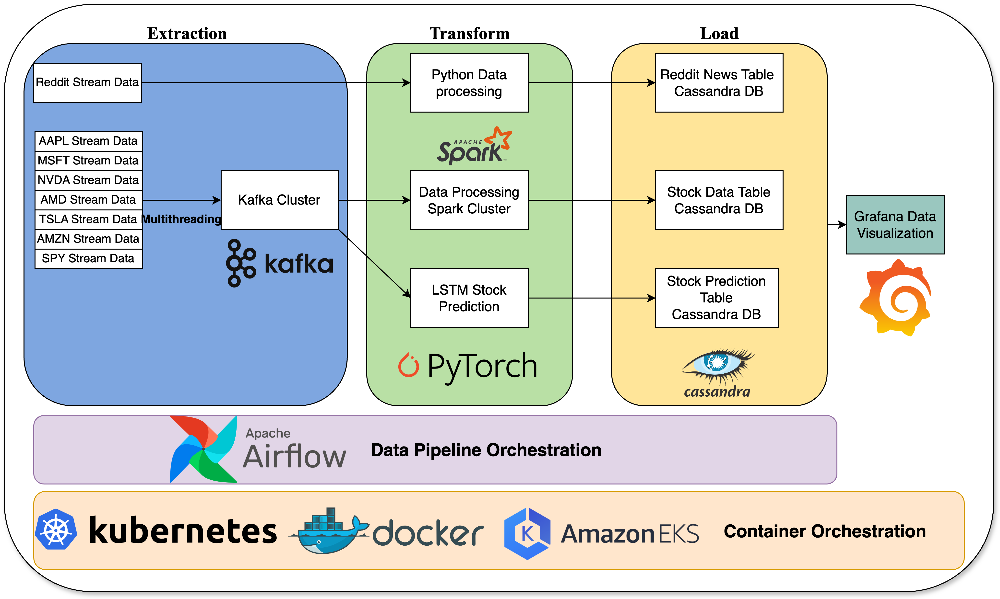

# Stock Streaming Project

## Project Description 

* This project leverages Python, Kafka, and Spark to process real-time streaming data from both stock markets and Reddit. It employs a Long Short-Term Memory (LSTM) deep learning model to conduct real-time predictions on SPY (S&P 500 ETF) stock data. Additionally, the project utilizes Grafana for the real-time visualization of stock data, predictive analytics, and reddit data, providing a comprehensive and dynamic overview of market trends and sentiments.

### Demo


### Project Structure



## Tools

1. Apache Airflow: Data pipeline orchestration
2. Apache Kafka: Stream data handling
3. Apache Spark: batch data processing
4. Apache Cassandra: NoSQL database to store time series data
5. Docker + Kubernets: Containerization and Docker Orchestration
6. Pytorch: Deep learning model 
7. Grafna: Stream Data visualization
8. Python: produce streaming data with multithreading

## Project Design Choice

### Kafka 

* Why Kafka?
  * Kafak serves a stream data handler to feed data into spark and deep learning model
* Design of kafka
  * I utilize Python's multi-threading capabilities to simultaneously produce stock data, enhancing the throughput by exploiting parallelism. Consequently, I partition the topic according to the number of stocks, allowing each thread to direct its data into a distinct partition, thereby optimizing the data flow and maximizing efficiency

### Cassandra Database Design

* Stock data contains the data of `stock` symbol and `utc_timestamp`, which can be used to uniquely identify the single data point. Therefore I use those two features as the primary key
* Use `utc_timestamp` as the clustering key to store the time series data in ascending order for efficient read(sequantial read for a time series data) and high throughput write(real-time data only appends to the end of parition) 
 
### Deep learning model Discussion

* Data
  * Train Data Dimension (N, T, D)
    * $N$ is number of data in a batch
    * $T=200$ look back two hundred seconds data 
    * $D=5$ the features in the data (price, number of transactions, high price, low price, volumes)
  * Prediction Data Dimension (1, 200, 5)
* Data Preprocessing:
  * Use MinMaxScaler to make sure each feature has similar scale
* [Model Structure](./docker-service/airflow/scripts/stock_deep_learning/):
  * X->[LSTM * 5]->Linear->Price-Prediction
* How the Model works:
  * At current timestamp $t$, get latest 200 time sereis data before $t$ in ascending `utc_timestamp` order. Feed the data into deep learning model which will predict the current SPY stock prie at time $t$.

* Due to the limited computational resources on my local machine, the "real-time" prediction lags behind actual time because of the long computation duration required.

## Future Direections

1. Deploy the local kubernets to AWS EKS and Use GPU accelerator on cloud
2. Train a better deep learning model to make prediction more accurate and faster


## Installment

### Requirements

1. `python3`
2. `Docker` is running and `K8S` is running
3. `Helm` is installed in local computer
4. `Dockerhub`
5. Docker builder will build the image for arm architecture, so make sure your computer(e.g Mac M1, M2, M3, ...) is compatible
6. [Stock API Key](https://polygon.io/)(Not Free)
7. [Reddit API Key](https://www.reddit.com/prefs/apps)

### Build the project:

1. At project root directory, run `env.py` to generate the environment file under the project root directory
2. Run the following command and wait all commands to finish: 

```bash
make k8s-kafka
make k8s-cassandra
make k8s-spark
make k8s-kafka-dashboard
make k8s-data-dashboard
make k8s-dashboard
```

3. For each command line in the following code snippet, run it in different terminal under root directory:

```bash
cd k8s/cassandra  && make cassandra-cluster-local-connection
cd k8s/kafka-dashboard && make kafka-dashboard-port-forward
cd k8s/spark && make spark-port-forward
cd k8s/grafana && make grafana-port-forward
make k8s-airflow
```

### Access the K8S resources

1. [k8s-dashboard](http://localhost:8001/api/v1/namespaces/kubernetes-dashboard/services/https:kubernetes-dashboard:/proxy/.) for Kubernets cluster monitor
2. [Airflow](http://localhost:10001) (username:admin, password: admin) for  real time data generation and consumption pipeline.
3. [kafka-ui](http://localhost:10000) : monitor kafka cluster status.
4. [spark-ui](http://localhost:10001) : monitor spark cluster status.s
5. [Grafani](http://localhost:3000) : Data Visualization
   1. username: admin 
   2. password: admin123

### Data Visualization:

* At [Grafani](http://localhost:3000), add data connection with provider `Apache-Cassandra` (Make sure data pipeline has started)
  * host: `cassandra.cassandra-cluster.svc.cluster.local:9042`
  * keyspace: `stock` 
  * user: cassandra, password:cassandra 
* Import the dashboard by import [dashboard.json](./k8s/grafana/dashboard.json). Remember to update **data resource** at each panel and change the **time range**

### Uinstall the project

* At the project root directory, run `make clean`

## File structure

```bash
.
├── Makefile
├── README.md
├── README_Resources
│   ├── demo.gif
│   └── project-arch.png
├── docker-service
│   └── airflow
│       ├── Dockerfile
│       ├── dags
│       │   ├── real_time_stock_consume.py
│       │   └── real_time_stock_data_generation.py
│       ├── python_requirements.txt
│       └── scripts
│           ├── cassandra_table_creation.py
│           ├── reddit-producer.py
│           ├── spark
│           │   └── spark_stream_processing.py
│           ├── stock_data_generation
│           │   ├── single_stock_generator.py
│           │   └── stock_generator.py
│           └── stock_deep_learning
│               ├── lstm_model.py
│               ├── lstm_model_weights.pth
│               ├── lstm_prediction.py
│               └── scaler.save
├── env.py
└── k8s
    ├── airflow
    │   ├── Makefile
    │   └── values.yaml
    ├── cassandra
    │   ├── Makefile
    │   └── values.yaml
    ├── grafana
    │   ├── Makefile
    │   ├── dashboard.json
    │   └── values.yaml
    ├── k8s-dashboard
    │   ├── Makefile
    │   └── dashboard-adminuser.yaml
    ├── kafka
    │   ├── makefile
    │   └── values.yaml
    ├── kafka-dashboard
    │   ├── makefile
    │   └── values.yml
    └── spark
        ├── Makefile
        └── values.yaml
```